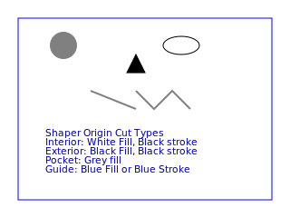

# Shaper Origin SVG support
## Shaper Origin cut types
The Shaper Origin supports different ways of cutting a path. This depends on whether the path is a closed shape (like a circle) or an open path like the letter L. Closed shapes can be cut with the router bit inside the path (Interior Cut), centered on the path (On-Line), or outside the path (Exterior cut). If a closed shape  is cut out entirely, it is a Pocket cut. The open shapes can only be cut On-Line. Shapes can be also be treated as Guides, just for reference, where no cut is done.

## Shaper Origin support for color codes
It is possible to use colors to encode cut styles for Shaper Origin. This is described in [Cut Type Encoding](https://support.shapertools.com/hc/en-us/articles/115002721473-Cut-Type-Encoding). The example below shows this encoding

The design above is in ../exp/svgs/shaper_shapes.svg. To get this file into Origin, upload the file to the _My Files_ section of [Shaper Hub](http://hub/shapertools.com/). Then Import the file from the Shaper Origin.
Obviously the color codes don't work for cut depth or cut width. As long as the svg units are specified in mm, cm or in, the shapes geometry is represented precisely. According to the SVG specification, dimensions of shapes specified without units inherit the viewbox units. 
Origin has difficulty representing text content, probably because it has limited font support but such text is safely ignored.