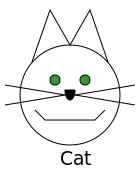

# Notes about Scalable Vector Graphics (svg) 

The SVG describing the picture above is located in ../exp/svgs/cat.svg.
It showcases a few basic elements of SVGS:
- lines
- polylines
- circles
- paths
- text

There's also an example of a mirror and shift transform
### Coordinates, Viewbox
Coordinates can be specified as
- *px* Pixels (the default if omitted)
- *pt* Points (1/72 inch)
- *pc* Pica (12 points)
- *cm* Centimeters
- *mm* Millimeters
- *in* Inches

When a unit is omitted, it defaults to *px* or to the *user coordinates* of the enclosing viewbox (described later)

Notice that mm, cm, in retain their expected ratios even if the exact dimensions on screen are not as measured.

The *width* and *height* parameters in the svg tag refer to the viewport or space on the screen.
The svg itself can be described on a separate rectangle by a *viewBox* with its own coordinates. If omitted, the viewbox is identical to the viewport.
### Viewport
The picture below illustrates use of the viewBox with the *meet* qualifier in the *preserveAspectRatio* viewBox mapping attribute.
The first three SVGs show the effect of yMid, yMin and yMax respectively in vertical alignent of the square viewBox to a rectangular viewPort.
The last three SVGs show the same thing with horizontal alignment

Rather than scale to fit, we can truncate the square viewBox to fit the rectangular viewPort. The next picture shows the use of the 
*slice* modifier to the *preserveAspectRatio* attribute to do that. The first three SVGs use yMid, yMin and yMax and the last three SVGs use xMid, xMin and xMax to define which edge of the viewBox matches the edge of the SVG.

### References
- [tavmjong's guide](http://tavmjong.free.fr/INKSCAPE/MANUAL/html/Web-SVG-Positioning.html)
- Chapter 3 of *SVG Essentials* by J. David Eisenberg
